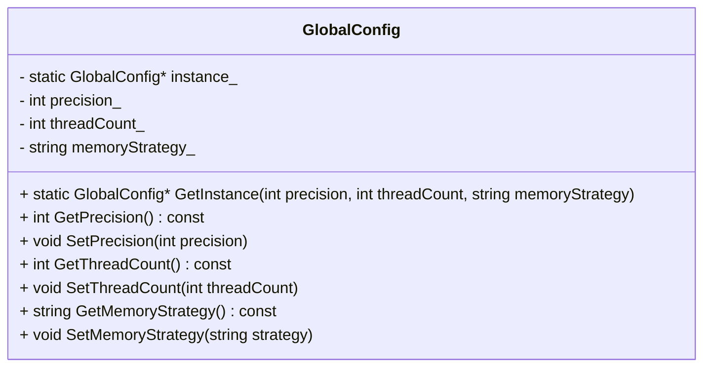
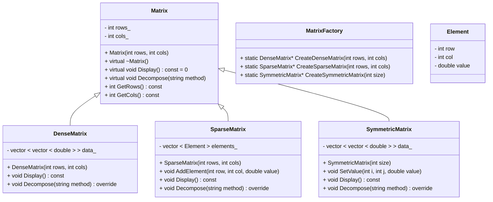

好的，以下是单独为`GlobalConfig`类绘制的UML类图：

![[Pasted image 20250114224406.png]]
在这个类图中：

- `GlobalConfig`类有4个私有成员变量：`instance_`、`precision_`、`threadCount_`和`memoryStrategy_`，分别用于存储单例实例指针、精度配置、线程数配置和内存策略配置。
    
- `GetInstance`方法是静态的，用于获取单例实例。它接受3个参数：`precision`、`threadCount`和`memoryStrategy`，用于初始化单例实例的配置。
    
- `GetPrecision`、`SetPrecision`、`GetThreadCount`、`SetThreadCount`、`GetMemoryStrategy`和`SetMemoryStrategy`方法是公共的，用于获取和设置类的配置属性。

以下是与`Matrix`相关的类绘制的UML类图：

![[Pasted image 20250114225008.png]]
![[Pasted image 20250114225209.png]]
![[Pasted image 20250114225331.png]]

在这个类图中：

- `Matrix`是一个抽象基类，定义了矩阵的基本属性和方法，包括行数和列数的存储、显示矩阵信息的纯虚函数`Display`、矩阵分解的接口`Decompose`以及获取行数和列数的方法。
    
- `DenseMatrix`、`SparseMatrix`和`SymmetricMatrix`是`Matrix`的派生类，分别表示密集矩阵、稀疏矩阵和对称矩阵。它们各自重写了`Display`和`Decompose`方法来实现具体的功能。
    
- `DenseMatrix`类有一个二维向量`data_`来存储矩阵元素。
    
- `SparseMatrix`类有一个`Element`结构体的向量`elements_`来存储非零元素，`Element`结构体包含行索引、列索引和元素值。
    
- `SymmetricMatrix`类也有一个二维向量`data_`来存储矩阵元素，并且提供了一个`SetValue`方法来同时设置对称位置的元素值。
    
- `MatrixFactory`类提供了静态的工厂方法来创建不同类型的矩阵实例。

#### 4.2.1 程序总体架构与目标

本程序旨在构建一个用于科学计算的矩阵操作平台，支持密集矩阵、稀疏矩阵和对称矩阵的创建、显示及分解。程序设计的总体目标包括：

- **全局配置统一管理：** 通过单例模式管理全局配置（如计算精度、线程数、内存策略），确保计算过程中的数据一致性和资源有效利用。
- **对象创建灵活扩展：** 使用工厂方法模式动态创建各类矩阵对象，使得系统具有良好的扩展性和低耦合性。
- **并发计算支持：** 通过多线程示例验证各模块在并发环境下能正常运行，并确保不同矩阵对象之间互不干扰。

下面详细介绍代码实现的主要部分及其功能。

---

#### 4.2.2 单例模式在全局配置中的实现

**实现目标：**  
在矩阵操作过程中，全局配置（例如计算精度和线程数）需要在多个模块之间共享。为此，实现了 `GlobalConfig` 类，该类通过单例模式确保系统中仅存在一个配置实例。

**代码实现要点：**

- **私有构造函数与静态实例变量：**  
    `GlobalConfig` 的构造函数被声明为私有，外部不能直接构造实例。类中有一个静态成员变量 `instance_` 用于存放唯一的单例对象。
    
- **静态访问接口：**  
    提供 `GetInstance(int precision = 10, int threadCount = 1, const std::string& memoryStrategy = "default")` 静态方法，用于获取全局配置实例。如果实例不存在，则根据传入参数创建；否则直接返回已有实例。这确保了全局只有一个配置对象。
    
- **数据读写接口：**  
    类中定义了 `GetPrecision`、`SetPrecision`、`GetThreadCount`、`SetThreadCount`、`GetMemoryStrategy` 和 `SetMemoryStrategy` 方法，用于对全局配置参数进行读写，所有使用配置的模块都调用这些接口。
    

**代码应用场景：**

- 在 `ConfigDemo()` 函数中，程序首先调用 `GlobalConfig::GetInstance()` 创建/获得全局配置，然后通过 setter 方法更新参数，再通过 getter 方法输出这些参数值，保证后续矩阵运算均采用相同的配置信息。

---

#### 4.2.3 工厂方法模式在矩阵对象创建中的应用

**实现目标：**  
针对不同的矩阵类型（密集、稀疏和对称），各自的数据结构和算法实现存在差异。使用工厂方法模式可以将对象的创建过程封装，客户端代码无需关心具体细节，从而提高代码的灵活性和可维护性。

**代码实现要点：**

- **Matrix 抽象基类：**  
    定义了虚函数 `Display()` 用于显示矩阵信息，虚函数 `Decompose(const std::string & method)` 用于矩阵分解操作。该类为所有具体矩阵类型提供统一接口。
    
- **各具体矩阵类：**
    
    1. **DenseMatrix：**
        - 内部使用二维 `std::vector<double>` 存储数据。
        - 重写 `Display()` 方法输出矩阵内容。
        - 在 `Decompose("LU")` 分支中，实现了密集矩阵的 LU 分解（实际代码中仅作提示，可扩展相应算法）。
    2. **SparseMatrix：**
        - 用一个 `std::vector<Element>` 存储非零元素（其中 `Element` 结构体记录元素的行、列、值）。
        - 重写 `Display()` 方法，仅输出非零元素的信息。
        - 在 `Decompose("QR")` 分支中，实现了稀疏矩阵的 QR 分解（实际仅输出提示）。
    3. **SymmetricMatrix：**
        - 采用二维 `std::vector<double>` 存储数据，要求矩阵为方阵，并在设置值时同时保证对称性。
        - 重写 `Display()` 方法输出矩阵内容。
        - 在 `Decompose("SVD")` 分支中，实现了对称矩阵的 SVD 分解（仅输出提示）。
- **矩阵工厂类：**  
    `MatrixFactory` 类为各矩阵对象提供了统一创建接口：
    
    - `CreateDenseMatrix(int rows, int cols)` 返回一个新建的密集矩阵对象。
    - `CreateSparseMatrix(int rows, int cols)` 返回一个新建的稀疏矩阵对象。
    - `CreateSymmetricMatrix(int size)` 返回一个新建的对称矩阵对象。
    
    工厂方法模式将矩阵的创建与使用分离，若将来需要新增或修改矩阵类型，只需调整工厂类，而无需改变调用者代码。
    

**代码应用场景：**

- 在每个演示函数（如 `DenseMatrixDemo()`、`SparseMatrixDemo()`、`SymmetricMatrixDemo()`）中，程序通过调用 `MatrixFactory` 的静态方法创建具体矩阵实例，然后调用其 `Display()` 方法展示数据，再调用 `Decompose()` 方法执行分解操作。
- 此外，多线程示例中，不同线程分别调用工厂方法创建各自需要的矩阵对象，证明在并发环境下，工厂方法能够提供独立且有效的对象初始化。

---

#### 4.2.4 集成实现与演示

单例模式和工厂方法模式的集成实现使系统具有模块化、灵活性和可维护性。在我们的实现中：

- **单例模式（GlobalConfig）：** 提供跨所有模块的一致全局配置。
- **工厂方法模式（MatrixFactory）：** 抽象并集中管理不同矩阵类型的创建。

多个演示函数展示了程序的功能：

- `ConfigDemo()`：初始化并打印全局配置。
- `DenseMatrixDemo()`：通过工厂创建密集矩阵，显示其内容，并模拟 LU 分解。
- `SparseMatrixDemo()`：创建稀疏矩阵，添加非零元素，显示它们，并模拟 QR 分解。
- `SymmetricMatrixDemo()`：创建对称矩阵，设置对称值，显示矩阵，并模拟 SVD 分解。
- `ThreadFunc()`：通过在不同线程中创建和处理矩阵对象，同时共享全局配置，演示并发计算。

通过以上方式，矩阵计算程序不仅实现了多种矩阵的创建、操作和分解，而且借助 Singleton 和 Factory Method 设计模式有效解决了数据一致性、资源管理和代码扩展性问题，为科学计算提供了一套高效、模块化且易于维护的解决方案。

#### 4.2.1 Overall Program Architecture and Objectives

This program aims to build a matrix operation platform for scientific computing, supporting the creation, display, and decomposition of dense, sparse, and symmetric matrices. The overall design goals include:

- **Unified Global Configuration Management:**  
    Utilize the Singleton pattern to manage global configurations (e.g., computational precision, thread count, memory strategy) to ensure data consistency and efficient resource utilization during computations.
    
- **Flexible and Extensible Object Creation:**  
    Apply the Factory Method pattern to dynamically create various matrix objects, enabling good scalability and low coupling within the system.
    
- **Concurrent Computing Support:**  
    Use multithreading examples to verify that each module operates correctly in a concurrent environment, ensuring that different matrix objects do not interfere with each other.
    

The following sections provide a detailed explanation of the key components and their functionalities.

---

#### 4.2.2 Singleton Pattern in Global Configuration

**Implementation Goal:**  
During matrix operations, global configurations (such as computational precision and thread count) need to be shared across multiple modules. To achieve this, the `GlobalConfig` class is implemented using the Singleton pattern to ensure that only one configuration instance exists in the system.

**Key Implementation Details:**

- **Private Constructor and Static Instance Variable:**  
    The constructor of `GlobalConfig` is private, preventing external instantiation. A static member variable `instance_` holds the unique Singleton object.
    
- **Static Access Interface:**  
    The static method `GetInstance(int precision = 10, int threadCount = 1, const std::string& memoryStrategy = "default")` provides access to the global configuration instance. If the instance does not exist, it is created with the provided parameters; otherwise, the existing instance is returned. This guarantees a single configuration object globally.
    
- **Data Access Methods:**  
    The class defines `GetPrecision`, `SetPrecision`, `GetThreadCount`, `SetThreadCount`, `GetMemoryStrategy`, and `SetMemoryStrategy` methods for reading and updating global configuration parameters. All modules access configuration data through these methods.
    

**Code Application Scenario:**

- In the `ConfigDemo()` function, the program first calls `GlobalConfig::GetInstance()` to create or retrieve the global configuration. It then updates parameters using setter methods and outputs them with getter methods, ensuring consistent configuration in subsequent matrix operations.

---

#### 4.2.3 Factory Method Pattern in Matrix Object Creation

**Implementation Goal:**  
Different matrix types (dense, sparse, symmetric) have distinct data structures and algorithm implementations. The Factory Method pattern encapsulates the object creation process, allowing client code to remain unaware of the underlying details, thereby improving flexibility and maintainability.

**Key Implementation Details:**

- **Matrix Abstract Base Class:**  
    Defines the virtual function `Display()` to show matrix information and the virtual function `Decompose(const std::string & method)` for matrix decomposition. This class provides a unified interface for all concrete matrix types.
    
- **Concrete Matrix Classes:**
    
    1. **DenseMatrix:**
        
        - Internally uses a two-dimensional `std::vector<double>` for data storage.
        - Overrides the `Display()` method to output matrix content.
        - Implements LU decomposition in the `Decompose("LU")` branch (currently as a placeholder, extendable to actual algorithms).
    2. **SparseMatrix:**
        
        - Uses a `std::vector<Element>` to store non-zero elements (`Element` records the row, column, and value).
        - Overrides the `Display()` method to output non-zero elements.
        - Implements QR decomposition in the `Decompose("QR")` branch (currently outputs a placeholder message).
    3. **SymmetricMatrix:**
        
        - Uses a two-dimensional `std::vector<double>` for data storage, ensuring the matrix is square and symmetric when values are set.
        - Overrides the `Display()` method to output matrix content.
        - Implements SVD decomposition in the `Decompose("SVD")` branch (currently outputs a placeholder message).
- **Matrix Factory Class:**  
    The `MatrixFactory` class provides a unified interface for creating different matrix objects:
    
    - `CreateDenseMatrix(int rows, int cols)` returns a newly created dense matrix.
    - `CreateSparseMatrix(int rows, int cols)` returns a newly created sparse matrix.
    - `CreateSymmetricMatrix(int size)` returns a newly created symmetric matrix.
    
    The Factory Method pattern separates matrix creation from usage, making it easy to add or modify matrix types by simply adjusting the factory class without changing client code.
    

**Code Application Scenario:**

- In demonstration functions (e.g., `DenseMatrixDemo()`, `SparseMatrixDemo()`, `SymmetricMatrixDemo()`), the program creates specific matrix instances through the `MatrixFactory`, displays their content using `Display()`, and performs decomposition via `Decompose()`.
- In multithreading examples, different threads call factory methods to create independent matrix objects, demonstrating that the factory method provides effective object initialization in concurrent environments.

---

#### 4.2.4 Integrated Implementation and Demonstration

The integration of the Singleton and Factory Method patterns enhances modularity, flexibility, and maintainability in the system. In our implementation:

- **Singleton Pattern (`GlobalConfig`):** Provides consistent global configuration across all modules.
- **Factory Method Pattern (`MatrixFactory`):** Abstracts and centrally manages the creation of different matrix types.

Multiple demonstration functions showcase the program's features:

- `ConfigDemo()`: Initializes and prints the global configuration.
- `DenseMatrixDemo()`: Creates a dense matrix via the factory, displays its content, and simulates LU decomposition.
- `SparseMatrixDemo()`: Creates a sparse matrix, adds non-zero elements, displays them, and simulates QR decomposition.
- `SymmetricMatrixDemo()`: Creates a symmetric matrix, sets symmetric values, displays the matrix, and simulates SVD decomposition.
- `ThreadFunc()`: Demonstrates concurrent computation by creating and processing matrix objects in different threads while sharing the global configuration.

Through these mechanisms, the matrix computation program effectively implements the creation, manipulation, and decomposition of various matrix types. By leveraging the Singleton and Factory Method design patterns, it successfully addresses data consistency, resource management, and code scalability challenges, offering an efficient, modular, and maintainable solution for scientific computing.
